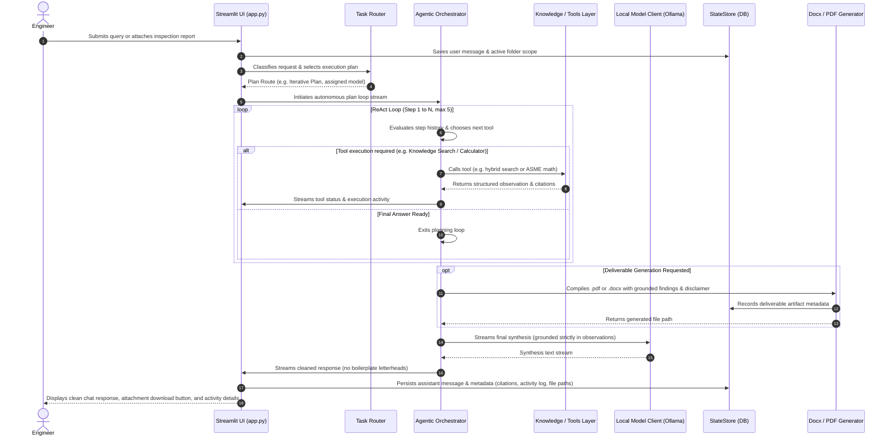

# 🛡️ Sovereign On-Premise Agentic AI Workbench
## Comprehensive Architecture, Module Deep Dive, and System Flow Guide

> **Audience:** Engineering team, collaborators, and technical stakeholders.  
> **Purpose:** Provide a clear, end-to-end understanding of the system architecture, how each module works, how they connect with one another, and how data flows through the workbench.

---

## 📑 Table of Contents
1. [Executive Summary & Core Philosophy](#1-executive-summary--core-philosophy)
2. [High-Level System Architecture](#2-high-level-system-architecture)
3. [End-to-End Execution Flow](#3-end-to-end-execution-flow)
4. [Detailed Module-by-Module Breakdown](#4-detailed-module-by-module-breakdown)
   - [4.1 Presentation Layer (`src/ui/`)](#41-presentation-layer-srcui)
   - [4.2 Intelligent Router (`src/router/`)](#42-intelligent-router-srcrouter)
   - [4.3 Orchestration & State Core (`src/core/`)](#43-orchestration--state-core-srccore)
   - [4.4 Hybrid Knowledge & Retrieval Layer (`src/knowledge/`)](#44-hybrid-knowledge--retrieval-layer-srcknowledge)
   - [4.5 Multimodal Extraction Engine (`src/multimodal/`)](#45-multimodal-extraction-engine-srcmultimodal)
   - [4.6 Deterministic Tools & Sandbox (`src/tools/`)](#46-deterministic-tools--sandbox-srctools)
   - [4.7 Deliverable Generation & Verification (`src/generation/`)](#47-deliverable-generation--verification-srcgeneration)
   - [4.8 Model Client & Hardware Lifecycle (`src/models/`)](#48-model-client--hardware-lifecycle-srcmodels)
   - [4.9 Security & Air-Gap Perimeter (`src/security/`)](#49-security--air-gap-perimeter-srcsecurity)
5. [Component Interaction & Connectivity Matrix](#5-component-interaction--connectivity-matrix)
6. [Step-by-Step Execution Scenarios](#6-step-by-step-execution-scenarios)
   - [Scenario A: Turnaround Inspection Analysis & Approval Note](#scenario-a-turnaround-inspection-analysis--approval-note)
   - [Scenario B: Autonomous RAG Query & PDF Report Generation](#scenario-b-autonomous-rag-query--pdf-report-generation)
7. [Deployment & Local Execution Guide](#7-deployment--local-execution-guide)

---

## 1. Executive Summary & Core Philosophy

The **Sovereign On-Premise Agentic AI Workbench** is a secure, air-gapped industrial AI platform built specifically for critical environments (such as oil refineries, petrochemical complexes, and power plants). In these facilities, sensitive data—such as Piping and Instrumentation Diagrams (P&IDs), turnaround non-destructive testing (NDT) reports, operational standard operating procedures (SOPs), and equipment maintenance logs—**must never leave the physical on-premise infrastructure**.

### Core Tenets of the Workbench:
1. **100% Sovereign & Air-Gapped:** Zero outbound internet or cloud sockets. All LLM inferences, embeddings, and computations occur on local loopback hardware.
2. **"Models are Stateless Workers; The System Never Forgets":** LLMs are treated as transient execution workers. State, memory, grounding evidence, and task status are persistently maintained in a relational and vector database (`StateStore`).
3. **Deterministic Math (Zero Arithmetic Hallucination):** Critical numbers (e.g. wall thinning percentages, corrosion rates, remaining useful life, ASME pressure limits) are calculated by deterministic Python engines and verified formulas, never by LLM token prediction.
4. **Evidence Grounding ("Shape is Not Truth"):** Every claim must trace back to a verified evidence record (`evidence_id`) with document name, page number, and source snippet.
5. **Single-GPU Hardware Adaptability:** Open-weight models (reasoning, vision/OCR, coding) are dynamically loaded and unloaded sequentially in VRAM through a hardware lifecycle gate, preventing out-of-memory crashes on consumer or single enterprise GPUs.
6. **Human-in-the-Loop Deliverables:** Generated engineering approval notes and technical PDF reports carry mandatory disclaimer banners requiring physical human review and sign-off.

---

## 2. High-Level System Architecture

The following diagram illustrates the complete architectural hierarchy:

```mermaid
flowchart TD
    subgraph UI ["1. Presentation Layer (Desktop Chat UI)"]
        StreamlitApp["Streamlit Command Center (src/ui/app.py)"]
        ChainlitApp["Chainlit Real-Time Interface (src/ui/chainlit_app.py)"]
    end

    subgraph Security ["2. Security Perimeter"]
        NetMon["Network Monitor (src/security/network_monitor.py)\n[Loopback Only, Zero Egress Check]"]
    end

    subgraph Routing ["3. Task Routing"]
        TaskRouter["Task Router (src/router/task_router.py)\n[Heuristic & Keyword Classifier]"]
    end

    subgraph Core ["4. Brain & Persistent State"]
        Orchestrator["Agentic Orchestrator (src/core/orchestrator.py)\n[Autonomous ReAct Planning & Execution Loop]"]
        StateStore["State Store (src/core/state_store.py)\n[SQLite / PostgreSQL + pgvector]"]
    end

    subgraph Knowledge ["5. Hybrid RAG Layer"]
        Chunker["Chunker (src/knowledge/chunker.py)"]
        BM25["BM25 Lexical Engine (src/knowledge/bm25.py)"]
        Embeddings["Embedding Model (src/knowledge/embeddings.py)"]
        Reranker["Cross-Encoder Reranker (src/knowledge/reranker.py)"]
        HybridRetriever["Hybrid Retriever (src/knowledge/hybrid_retriever.py)\n[RRF Fusion k=60]"]
    end

    subgraph Multimodal ["6. Multimodal Extraction"]
        DocExtractor["Document Extractor (src/multimodal/document_extractor.py)\n[PyMuPDF + Local Vision / OCR]"]
    end

    subgraph Tools ["7. Deterministic Tools & Sandbox"]
        Calc["Deterministic Calculator (src/tools/calculator.py)\n[ASME B31.3 / API 570 / AST Math]"]
        Sandbox["Hardened Sandbox (src/tools/sandbox.py)\n[Docker --network none --pull never]"]
        FileTools["File System Tools (src/tools/file_tools.py)"]
    end

    subgraph Gen ["8. Deliverable Generation & Verification"]
        DocxGen["DOCX Generator (src/generation/docx_generator.py)"]
        PdfGen["PDF Generator (src/generation/pdf_generator.py)"]
        Verifier["Artifact Verifier (src/generation/verifier.py)"]
    end

    subgraph Models ["9. Local LLM Runtime & VRAM Lifecycle"]
        Lifecycle["Hardware Lifecycle Manager (src/models/lifecycle.py)\n[Single-GPU Sequential Gate]"]
        ModelClient["Model Client (src/models/model_client.py)\n[Ollama Loopback Client]"]
    end

    %% UI Connections
    StreamlitApp --> NetMon
    StreamlitApp --> TaskRouter
    StreamlitApp --> Orchestrator
    ChainlitApp --> Orchestrator

    %% Routing & Orchestration
    TaskRouter --> Orchestrator
    Orchestrator <--> StateStore

    %% Orchestrator to Engines
    Orchestrator --> HybridRetriever
    Orchestrator --> DocExtractor
    Orchestrator --> Calc
    Orchestrator --> Sandbox
    Orchestrator --> FileTools
    Orchestrator --> DocxGen
    Orchestrator --> PdfGen
    Orchestrator --> Verifier

    %% Knowledge Sub-connections
    HybridRetriever --> Chunker
    HybridRetriever --> BM25
    HybridRetriever --> Embeddings
    HybridRetriever --> Reranker

    %% Model Sub-connections
    DocExtractor --> ModelClient
    Orchestrator --> ModelClient
    ModelClient --> Lifecycle
```



---

## 3. End-to-End Execution Flow

When an engineer interacts with the system, the execution follows this lifecycle:



---

## 4. Detailed Module-by-Module Breakdown

Below is a detailed examination of each package and module in the repository.

### 4.1 Presentation Layer (`src/ui/`)

#### `src/ui/app.py`
- **What it does:** The primary user interface of the platform, built as a modern, clean, desktop-chat application using Streamlit.
- **Key Features:**
  - **Left Sidebar (270px):** "+ New chat" action, recent conversations list, active chat deletion, and settings toggle.
  - **Top Bar:** Workspace folder scope dropdown (`Refinery Integrity`, `General`, `SOPs`, etc.), "Local" air-gap status indicator, and quick gear icon.
  - **Centered Conversation Feed:** Focused reading width (780px), distinct avatars (`👤` User, `🛡️` Assistant), download rows for generated `.docx` and `.pdf` files.
  - **Collapsible Activity Disclosures:** Quiet "Activity · X steps complete ▾" box showing tools invoked, execution durations, and citations without cluttering the main response text.
  - **Slide-out Settings Drawer:** Multi-tab drawer covering:
    1. *Workspace & Knowledge:* Upload documents, create folders, inspect chunks, delete files, re-index.
    2. *Models & Runtime:* Active model, GPU VRAM usage telemetry, context budget.
    3. *Tools & Calculators:* Interactive ASME B31.3 and API 570 calculators, Docker status.
    4. *Security & Audit:* Active socket connections list, air-gap status, grounded evidence log.
    5. *Preferences:* Theme, font size, auto-scroll.
  - **Sanitization Pipeline (`clean_boilerplate_header`):** Strips any repetitive system letterheads, problem statement boilerplate, or metadata blocks from answers.

#### `src/ui/chainlit_app.py`
- **What it does:** Alternative conversational UI built using Chainlit, providing real-time streaming steps (`cl.Step`) for terminal/browser interaction.

---

### 4.2 Intelligent Router (`src/router/`)

#### `src/router/task_router.py`
- **What it does:** Acts as the traffic controller. Analyzes the incoming user prompt, file attachments, and historical context to classify intent and route to the most specialized local model.
- **Five Routing Branches:**
  1. **Vision / OCR Specialist (`frob/unlimited-ocr:3b` or `qwen2.5vl:3b`):** Triggered by images, scanned PDFs, inspection logs, or visual diagrams.
  2. **Code Specialist (`qwen2.5-coder:7b`):** Triggered by programming keywords (`def `, `import `, `algorithm`, `function`, `script`, `b tree`).
  3. **Retrieval Specialist (`hybrid_rag_engine`):** Triggered by standards, SOPs, retirement limits, clauses, and company procedures.
  4. **Reasoning Specialist (`qwen3.5:9b`):** Triggered by complex multi-factor synthesis, root-cause analyses, or risk evaluations.
  5. **Deterministic Calculator (`deterministic_calculator`):** Triggered by arithmetic expressions, unit conversions, or corrosion calculations.
- **Execution Plan Selection:** Assigns execution strategy (`single_step`, `code_execution`, `retrieval_augmented`, or `iterative_plan`).

---

### 4.3 Orchestration & State Core (`src/core/`)

#### `src/core/orchestrator.py`
- **What it does:** The central brain of the agentic system. Implements an autonomous **ReAct (Reason + Act)** loop that plans, calls tools, observes outputs, and synthesizes answers.
- **Key Functions:**
  - `run_autonomous_plan_loop_stream()`: Generator yielding real-time events (`plan_start`, `tool_call`, `tool_result`, `final_chunk`, `completed`).
  - `_decide_next_step()`: Uses the local reasoning model (with deterministic fallback fast-routes) to pick the next action from registered tools or decide that enough info exists for `final_answer`.
  - `_build_synthesis_prompt()`: Strict synthesis prompt restricting the LLM to verified observations and citations, forbidding ungrounded arithmetic or hallucinations.
  - `run_hero_inspection_workflow()`: End-to-end 7-step turnkey workflow (Extract -> RAG -> Calculate -> Synthesize -> Generate DOCX -> Verify XML).
  - `clean_boilerplate_header()`: Post-processing sanitizer ensuring generated answers start directly with technical findings.

#### `src/core/state_store.py`
- **What it does:** The system's relational and vector memory. Handles data persistence using SQLAlchemy (supporting local SQLite `workbench_state.db` or enterprise PostgreSQL with `pgvector`).
- **Core Database Entities:**
  - `chat_sessions` & `chat_messages`: Conversation sessions and message histories with structured JSON metadata.
  - `projects`: High-level initiatives and workspaces.
  - `tasks`: Task contracts with strict status discipline (`PENDING` ➔ `RUNNING` ➔ `COMPLETED` / `FAILED`).
  - `evidence`: Grounded facts (`evidence_id`, `source_document`, `page_number`, `confidence_score`).
  - `knowledge_chunks`: Indexed document chunks with text, metadata, and 384-dimensional vector embeddings.
  - `artifacts`: Generated deliverable files (`.docx`, `.pdf`) and their verification pass/fail status.
  - `model_activity_log`: Audit trail of model loading, unloading, and VRAM residency.

---

### 4.4 Hybrid Knowledge & Retrieval Layer (`src/knowledge/`)

#### `src/knowledge/hybrid_retriever.py`
- **What it does:** Combines keyword search and semantic vector search into an ensemble retriever using **Reciprocal Rank Fusion (RRF, $k=60$)**.
- **How it works:**
  1. Executes BM25 lexical search over tokenized documents.
  2. Executes dense semantic similarity search using vector embeddings.
  3. Fuses both rankings using $RRF(d) = \sum_{m \in M} \frac{1}{60 + r_m(d)}$.
  4. Filters by category/folder scope (e.g. `Refinery Integrity`, `SOPs`, `General`).
  5. Passes candidates to the cross-encoder reranker for fine-grained re-scoring.

#### `src/knowledge/bm25.py`
- **What it does:** Pure Python implementation of the Okapi BM25 algorithm ($k_1=1.5, b=0.75$) with inverse document frequency (IDF) calculation and query tokenization.

#### `src/knowledge/embeddings.py`
- **What it does:** Generates dense 384-dimensional embeddings using the local SentenceTransformers model (`all-MiniLM-L6-v2`) in offline mode. Computes cosine similarity matrices.

#### `src/knowledge/reranker.py`
- **What it does:** Precision cross-encoder that jointly encodes `(query, document_passage)` pairs to produce an exact semantic relevance score between 0.0 and 1.0.

#### `src/knowledge/chunker.py`
- **What it does:** Splits documents into coherent, context-preserving passages using markdown heading hierarchies and recursive paragraph boundaries, preserving metadata (document title, section, page).

---

### 4.5 Multimodal Extraction Engine (`src/multimodal/`)

#### `src/multimodal/document_extractor.py`
- **What it does:** Ingests inspection reports, scans, and technical documents (PDF, DOCX, MD, TXT, PNG, JPG).
- **How it works:**
  - If a digital text layer exists in the PDF, it extracts and parses tables and text directly using PyMuPDF (`fitz`).
  - If the document is scanned or an image, it renders pages to images and passes them to the local Vision model (`qwen2.5vl:3b`) or OCR specialist (`unlimited-ocr:3b`).
  - Converts extracted readings (e.g. residual wall thickness, hydro-test pressures) into structured evidence objects (`E001`, `E002`) in the `StateStore`.

---

### 4.6 Deterministic Tools & Sandbox (`src/tools/`)

#### `src/tools/calculator.py`
- **What it does:** Deterministic mathematical engine. Prevents LLMs from hallucinating numbers or performing faulty arithmetic.
- **Formulas & Calculators:**
  - **AST Expression Evaluator:** Safely parses and evaluates mathematical expressions using Python's Abstract Syntax Tree (disallowing unsafe code execution).
  - **Wall Thinning Calculator:** Computes metal loss, percentage loss against nominal thickness, and deviation below mandatory retirement thresholds.
  - **ASME B31.3 Process Piping Calculator:** Computes minimum required wall thickness:
    $$t_m = \frac{P \cdot D}{2(S \cdot E + P \cdot Y)} + c$$
  - **API 570 Corrosion Rate & RUL Calculator:**
    $$\text{Corrosion Rate} = \frac{t_{\text{previous}} - t_{\text{current}}}{\Delta \text{years}}$$
    $$\text{Remaining Useful Life (RUL)} = \frac{t_{\text{current}} - t_{\text{retirement}}}{\text{Corrosion Rate}}$$
    $$\text{Inspection Interval} = \min\left(\frac{\text{RUL}}{2}, 5.0 \text{ years}\right)$$

#### `src/tools/sandbox.py`
- **What it does:** Isolated execution environment for running Python scripts generated by models or requested by users.
- **Security Controls:**
  - Mandatory Docker execution (`--network none`, `--pull never`, read-only root filesystem, non-root user, 256 MB RAM cap, 10s timeout watchdog).
  - If Docker is unavailable, refuses host execution to prevent arbitrary code execution on host machines.

#### `src/tools/file_tools.py`
- **What it does:** Provides secure, bounded file reading and writing utilities constrained strictly to approved `data/` and `outputs/` directories.

---

### 4.7 Deliverable Generation & Verification (`src/generation/`)

#### `src/generation/docx_generator.py`
- **What it does:** Generates formatted Microsoft Word (`.docx`) Technical Approval Notes.
- **Features:** Styled headers, project metadata tables, executive summaries, findings compliance tables, SOP citation evidence snippets, and human engineering sign-off blocks with prominent review banners.

#### `src/generation/pdf_generator.py`
- **What it does:** Compiles technical reports into clean, publication-grade PDF documents using ReportLab.
- **Features:** Amber disclaimer banner, corporate title header, metadata grid, multi-section body, grounded citations matrix, and sign-off blocks.

#### `src/generation/verifier.py`
- **What it does:** Automated quality and compliance gate. Inspects generated deliverables before release:
  - Validates XML structure of `.docx` files.
  - Verifies presence of the mandatory "AI-GENERATED DRAFT — HUMAN REVIEW REQUIRED" disclaimer.
  - Verifies inclusion of required technical sections.

---

### 4.8 Model Client & Hardware Lifecycle (`src/models/`)

#### `src/models/model_client.py`
- **What it does:** Unified HTTP client connecting exclusively to local Ollama endpoints (loopback `127.0.0.1:11434`).
- **Capabilities:** Text generation, streaming chunk generation, JSON schema extraction and repair, and task execution wrappers. Refuses remote model endpoints.

#### `src/models/lifecycle.py`
- **What it does:** Hardware-adaptive single-GPU residency manager.
- **Why it is critical:** Loading multiple large LLMs simultaneously causes GPU out-of-memory (VRAM OOM) crashes. The lifecycle manager tracks active resident models, sends unload signals (`keep_alive: 0`) to previous models, and loads the new model into memory sequentially.

---

### 4.9 Security & Air-Gap Perimeter (`src/security/`)

#### `src/security/network_monitor.py`
- **What it does:** Host-level network socket auditor.
- **Mechanism:** Continuously polls active network sockets via `psutil.net_connections()`.
- **Integrity Check:** Asserts that all connections belong to local loopback (`127.0.0.1`, `::1`). If an external socket or non-local IP is detected during model execution, it immediately triggers an air-gap egress alert.

---

## 5. Component Interaction & Connectivity Matrix

| Component A | Connects To | Data / Payload Transferred | Purpose |
| :--- | :--- | :--- | :--- |
| **Streamlit UI (`app.py`)** | `TaskRouter` | Prompt string, attachment path | Obtains model classification & routing advice |
| **Streamlit UI (`app.py`)** | `AgenticOrchestrator` | User prompt, project ID, folder category | Executes streaming ReAct loop & receives events |
| **Streamlit UI (`app.py`)** | `StateStore` | Chat sessions, messages, preferences | Reads/writes persistent chat history & settings |
| **AgenticOrchestrator** | `HybridRetriever` | Query string, category, top_k | Retrieves ranked document passages & SOP citations |
| **AgenticOrchestrator** | `DeterministicCalculator` | Thickness, pressure, diameter numbers | Computes ASME / API 570 formulas with zero hallucination |
| **AgenticOrchestrator** | `CodeSandbox` | Python code string | Executes code in an isolated Docker container |
| **AgenticOrchestrator** | `PdfDeliverableGenerator` | Title, summary, sections, findings, citations | Generates verified ReportLab `.pdf` deliverable |
| **AgenticOrchestrator** | `DocxApprovalNoteGenerator` | Title, summary, findings, calculation data | Generates verified `.docx` technical approval note |
| **AgenticOrchestrator** | `ArtifactVerifier` | Deliverable file path | Verifies XML integrity and human-review disclaimer |
| **AgenticOrchestrator** | `ModelClient` | Structured prompts, context, observations | Queries local LLM for thoughts, actions, and synthesis |
| **ModelClient** | `HardwareLifecycleManager` | Model name (`qwen3.5:9b`, `qwen2.5-coder:7b`) | Unloads previous model and loads requested model in VRAM |
| **MultimodalExtractor** | `ModelClient` | Rendered page image / text | Performs OCR or visual document extraction |
| **HybridRetriever** | `BM25Engine` & `DenseEmbeddings` | Search tokens & query vector | Executes lexical and semantic search over chunks |
| **HybridRetriever** | `CrossEncoderReranker` | Query + top candidate passages | Re-scores candidates to output top precision results |
| **NetworkMonitor** | Operating System Sockets | TCP/UDP socket telemetry | Audits 0 external connections to guarantee 100% air-gap |

---

## 6. Step-by-Step Execution Scenarios

### Scenario A: Turnaround Inspection Analysis & Approval Note
*(When the user clicks "Summarize an inspection report" or uploads a turnaround scan)*

1. **User Action:** The user attaches an ultrasonic inspection report or asks to evaluate `CDU-1 transfer line`.
2. **Extraction (`T001`):** `MultimodalDocumentExtractor` opens the file, renders pages, and extracts ultrasonic measurements:
   - Measured thickness: `3.42 mm` (Nominal: `8.00 mm`).
   - Flange `FL-208`: micro-fissuring noted during 142 bar hydro-test.
   - Registers findings as evidence `E001` and `E002` in `StateStore`.
3. **Retrieval (`T002`):** `HybridRetriever` queries SOPs in the `Refinery Integrity` category for pipe retirement thresholds:
   - Retrieves `SOP-17 Section 4.2`: Mandatory retirement thickness for crude transfer lines = `4.80 mm`.
4. **Deterministic Math (`T003`):** `DeterministicCalculator` computes:
   - Loss = $8.00 - 3.42 = 4.58\text{ mm}$ (57.25% loss).
   - Breach Margin = $\frac{4.80 - 3.42}{4.80} \times 100 = 28.75\%$ breach below safety threshold.
5. **Synthesis (`T004`):** `ModelClient` (Qwen 3.5) synthesizes the findings into an executive technical evaluation based strictly on `E001`, `E002`, and the verified 28.75% calculation.
6. **Deliverable Generation (`T005`):** `DocxApprovalNoteGenerator` generates the formatted `.docx` file in `outputs/`.
7. **Verification (`T006`):** `ArtifactVerifier` checks XML integrity and confirms the disclaimer banner is present.
8. **UI Presentation:** The Streamlit app renders the executive summary, displays an attachment card to download the `.docx`, and provides an activity audit log.

---

### Scenario B: Autonomous RAG Query & PDF Report Generation
*(When the user types: `"What are the retirement limits under SOP-17? Make me a PDF file from this"`)*

1. **Step 1 (Plan & Search):**
   - The Orchestrator initiates step 1. Recognizes the query requires procedure knowledge.
   - Calls `knowledge_search(query="retirement limits under SOP-17", category="SOPs")`.
   - The hybrid retriever returns relevant passages with page numbers and section titles.
2. **Step 2 (Plan & Compile Deliverable):**
   - The Orchestrator inspects the history and sees that the user requested a PDF file.
   - Invokes `generate_pdf_report(title="SOP-17 Retirement Limits", sections=[...], citations=[...])`.
   - `PdfDeliverableGenerator` creates `outputs/SOP_17_Retirement_Limits_Report.pdf`.
3. **Step 3 (Synthesize Final Answer):**
   - Orchestrator invokes `final_answer`.
   - `ModelClient` streams the synthesized answer summarizing the SOP requirements.
   - `clean_boilerplate_header()` strips any top letterhead or metadata.
   - The Streamlit UI renders the answer, shows a `⬇ Download PDF` button, and logs the complete audit trail.

---

## 7. Deployment & Local Execution Guide

### Prerequisites
- **Operating System:** Windows 10/11, Linux, or macOS.
- **Python:** Version 3.10 to 3.12.
- **Ollama:** Installed locally and running on `http://127.0.0.1:11434`.
  - Required models: `ollama pull qwen2.5:7b` (or `qwen3.5:9b`), `ollama pull qwen2.5-coder:7b`, `ollama pull qwen2.5-vl:3b`.
- **Docker:** Optional for general RAG; required if running sandboxed Python execution.

### Installation & Launch Steps

1. **Clone and Enter Directory:**
   ```powershell
   cd sovereign-agentic-workbench
   ```

2. **Install Python Dependencies:**
   ```powershell
   pip install -r requirements.txt
   ```

3. **Launch Streamlit Desktop Command Center (Primary UI):**
   ```powershell
   python -m streamlit run src/ui/app.py --server.port 8501
   ```
   Open your browser at **`http://localhost:8501`**.

4. **(Optional) Launch Chainlit Interface:**
   ```powershell
   python -m chainlit run src/ui/chainlit_app.py --port 8000
   ```

5. **Run the Full Test Suite:**
   ```powershell
   python -m pytest -v
   ```

---

*This document serves as the architectural specification and onboarding manual for the Sovereign On-Premise Agentic AI Workbench.*
