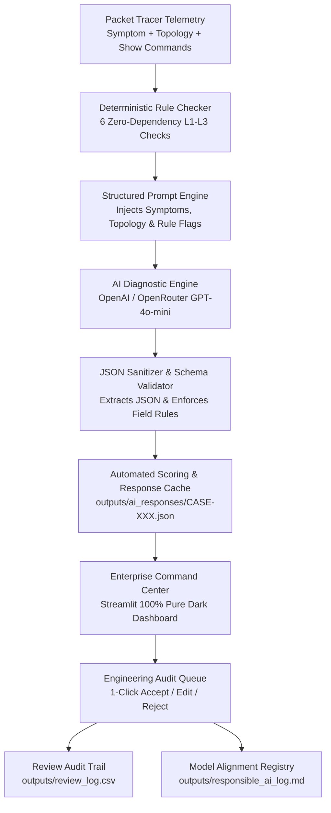

# NetSage AI: Technical System Architecture & Comprehensive Project Documentation

**Project Name:** NetSage AI — Intelligent Network Diagnostic & Troubleshooting Platform  
**Target Domain:** Cisco Packet Tracer Labs & Enterprise Network Operations  
**Architecture:** Hybrid Deterministic Pre-AI Guardrails + LLM Diagnostic Engine + Human-in-the-Loop (HITL) Oversight  
**Version:** 2.0.0 (Enterprise Local Edition)  

---

## 📑 Table of Contents
1. [Executive Summary & Project Scope](#1-executive-summary--project-scope)
2. [High-Level System Architecture](#2-high-level-system-architecture)
3. [Component-by-Component Deep Dive](#3-component-by-component-deep-dive)
   - [3.1 Deterministic Pre-AI Rule Checker (`src/rule_checker.py`)](#31-deterministic-pre-ai-rule-checker-srcrule_checkerpy)
   - [3.2 AI Diagnostic Engine & Prompt Library (`src/diagnose.py`)](#32-ai-diagnostic-engine--prompt-library-srcdiagnosepy)
   - [3.3 Metrics & Data Ingestion System (`src/metrics.py`)](#33-metrics--data-ingestion-system-srcmetricspy)
   - [3.4 Human-in-the-Loop Review System (`src/review.py`)](#34-human-in-the-loop-review-system-srcreviewpy)
   - [3.5 Modern Streamlit Command Center (`dashboard/app.py`)](#35-modern-streamlit-command-center-dashboardapppy)
4. [Dataset Specification (`data/cases.csv`)](#4-dataset-specification-datacasescsv)
5. [Responsible AI & Model Alignment Framework](#5-responsible-ai--model-alignment-framework)
6. [Comprehensive Test Suite & Verification (`tests/`)](#6-comprehensive-test-suite--verification-tests)
7. [Installation, Configuration & Operational Guide](#7-installation-configuration--operational-guide)
8. [Step-by-Step User Workflows](#8-step-by-step-user-workflows)

---

## 1. Executive Summary & Project Scope

### 1.1 The Industry Challenge
Junior network engineers and students working in Cisco Packet Tracer or enterprise lab environments frequently know individual IOS commands (`show ip route`, `show interfaces trunk`, `show ip interface brief`, `ipconfig`), but struggle to systematically correlate observable symptoms with the underlying root cause.

When a client device experiences connectivity failure (e.g., gets an IP address but cannot reach a server), the fault could originate at multiple OSI layers:
- **Layer 2:** Missing VLAN from switchport trunk allow-lists, native VLAN mismatches, STP blocking.
- **Layer 3:** Subnet mask discrepancies placing the gateway outside the host subnet, missing default routes, static IP collisions.
- **Layer 4 / Security:** ACL inbound/outbound packet drops, stateful NAT translation pool exhaustion.
- **Layer 7:** DNS resolver failures, DHCP relay (`ip helper-address`) omissions.

### 1.2 The NetSage AI Solution
**NetSage AI** is an AI-assisted network troubleshooting platform specifically engineered to bridge this gap through a multi-tier safety architecture:
1. **Deterministic Guardrails:** Runs 6 zero-dependency Python rule checks *before* AI inference to catch physical down states, IP collisions, and trunk errors.
2. **Evidence-Backed Diagnostic Engine:** Enforces structured JSON output requiring exact, verbatim quotes from live `show` commands to prevent hallucinations.
3. **Human-in-the-Loop Authority:** Treats all AI recommendations as strictly provisional until audited, corrected, or approved by a human engineer.
4. **Responsible AI Alignment Registry:** Logs every instance where human intervention corrected the AI model to eliminate recurring failure modes.

---

## 2. High-Level System Architecture



### Core Architectural Invariants:
- **Zero Hallucination Tolerance:** The AI is strictly constrained by prompt rules to use *only* provided evidence and quote verbatim lines from CLI outputs.
- **Pre-AI Determinism:** Deterministic rule flags are computed first and passed directly to the model as trusted ground truth.
- **Human Authority:** The system never executes automated remediation without human verification.

---

## 3. Component-by-Component Deep Dive

### 3.1 Deterministic Pre-AI Rule Checker (`src/rule_checker.py`)
A standalone, zero-external-dependency Python engine that parses standard Cisco IOS output formats using regex and standard library `ipaddress`.

#### The 6 Deterministic Checks:

```
┌─────────────────────────────────────────────────────────────────────────────┐
│                       6 DETERMINISTIC RULE CHECKERS                         │
├────────────────────────┬────────────────────────────────────────────────────┤
│ 1. check_duplicate_ip  │ Parses ARP tables and ipconfig dumps for collisions│
├────────────────────────┼────────────────────────────────────────────────────┤
│ 2. check_wrong_mask    │ Validates CIDR subnet prefix containment           │
├────────────────────────┼────────────────────────────────────────────────────┤
│ 3. check_gateway_match │ Verifies host default gateway matches SVI address  │
├────────────────────────┼────────────────────────────────────────────────────┤
│ 4. check_iface_down    │ Catches 'administratively down' & 'down down'      │
├────────────────────────┼────────────────────────────────────────────────────┤
│ 5. check_missing_vlan  │ Expands trunk ranges (e.g. 10-20) & checks VLAN DB │
├────────────────────────┼────────────────────────────────────────────────────┤
│ 6. check_missing_route │ Validates routing reachability including 0.0.0.0/0 │
└────────────────────────┴────────────────────────────────────────────────────┘
```

1. **`check_duplicate_ip`**:
   - Parses host `ipconfig` outputs and Cisco ARP tables (`show ip arp`).
   - Automatically detects when two distinct MAC addresses or hostnames claim the same IPv4 address on the same broadcast domain.
   - Ignores APIPA addresses (`169.254.0.0/16`) to avoid false alarms.
2. **`check_wrong_mask`**:
   - Parses IP addresses and subnet masks across all interfaces.
   - Computes network boundaries using `ipaddress.IPv4Interface`.
   - Flags when two devices on the same physical link have conflicting subnet mask lengths (e.g., `/24` vs `/25`).
3. **`check_gateway_mismatch`**:
   - Correlates host default gateway configurations with router/switch SVI IP addresses.
   - Flags if the host gateway is not an active IP on the local SVI or falls outside the local subnet.
4. **`check_interface_down`**:
   - Scans `show ip interface brief` and `show interfaces` outputs.
   - Detects both `administratively down / down` (interface disabled via `shutdown`) and `down / down` (physical Layer 1 cable disconnect or transceiver failure).
5. **`check_missing_vlan`**:
   - Implements `_parse_vlan_tokens()` with full range expansion:
     - `1-10,20,30-35` $\to$ expands to `{1,2,3,4,5,6,7,8,9,10,20,30,31,32,33,34,35}`.
     - Handles `ALL` ($\to 1..4094$) and `NONE`.
   - Cross-references VLAN database (`show vlan brief`) against trunk allow-lists (`show interfaces trunk`) to catch missing VLANs on uplinks.
6. **`check_missing_route`**:
   - Uses `ipaddress` network containment (`target_net.subnet_of(route_net)`).
   - Recognizes `0.0.0.0/0` default gateway routes and summarized supernets (`192.168.0.0/16`), preventing false missing-route flags.

---

### 3.2 AI Diagnostic Engine & Prompt Library (`src/diagnose.py`)
Interfaces with OpenAI or OpenRouter LLM endpoints (`gpt-4o-mini`) to synthesize comprehensive root causes and step-by-step remediation plans.

#### Key Features:
- **Prompt Library ([prompts/diagnose_prompt.md](file:///C:/Users/Shridhar/Projects/netsage-ai/prompts/diagnose_prompt.md)):** Contains system instructions, hard rules, confidence calibration guidelines, output schema, and 3 worked Packet Tracer examples.
- **Robust Prompt Parser (`load_prompt_parts`):** Parses `<<<SYSTEM>>>`, `<<<TEMPLATE>>>`, and `<<<EXAMPLES>>>` section delimiters reliably.
- **JSON Sanitization (`_extract_json`):** Strips markdown code fences (```` ```json ````) and extracts valid JSON substrings, eliminating `JSONDecodeError`.
- **Fault-Tolerant Exponential Backoff (`call_openai`):** Automatically retries on HTTP 429 rate limits and transient connection errors with randomized jitter.
- **Schema Validation (`validate_diagnosis`):** Enforces mandatory fields: `root_cause`, `osi_layer`, `confidence` (`low`/`medium`/`high`), `evidence` (non-empty array of quoted lines), `next_command`, `fix_steps`, and `concept_tag`.
- **Mock Mode (`mock_diagnosis`):** Provides an offline plumbing mode that generates structured diagnostic responses without consuming API credits.

---

### 3.3 Metrics & Data Ingestion System (`src/metrics.py`)
Computes platform-wide statistics for the dashboard and CLI:
- **Deduplicated Review Ingestion:** Ingests `outputs/review_log.csv` and deduplicates by `case_id`, guaranteeing that updating a case's verdict never distorts audit counts or agreement percentages.
- **Calculated Telemetry:**
  - `total_cases`: Total incidents in `data/cases.csv`.
  - `responded`: Cases with valid AI diagnoses.
  - `reviewed`: Unique cases audited by engineers.
  - `pending_review`: Cases awaiting audit.
  - `accepted` / `edited` / `rejected`: Distribution of human verdicts.
  - `agreement_rate`: Percentage of diagnoses accepted without modification.
  - `rai_entries`: Documented model correction count in `outputs/responsible_ai_log.md`.

---

### 3.4 Human-in-the-Loop Review System (`src/review.py`)
Provides both a CLI tool and backing library for human oversight:
- **`append_review(case_id, ai_cause, human_cause, status, notes)`**: Records audit actions to `outputs/review_log.csv`.
- **`append_rai_entry(case_id, ai_cause, human_cause, why_wrong, prevention)`**: Automatically generates structured model failure entries in `outputs/responsible_ai_log.md`.

---

### 3.5 Modern Streamlit Command Center (`dashboard/app.py`)
A multi-page, 100% pure dark theme platform tailored for NOC engineers and evaluators.

#### Visual Design & Theme System:
- **Pure Dark Palette:** Unified deep midnight `#080c16` background with `#0f172a` cards, eliminating all white/light bleeding.
- **Modern Typography:** Google Fonts (`Outfit` for headings, `Inter` for body, `JetBrains Mono` for Cisco IOS commands).
- **Web Deploy Suppression:** Custom CSS strictly hides Streamlit's `Deploy` button and top header menus for a distraction-free experience.
- **Collapsible Sidebar:** Top-left glowing toggle button (`>>` / `<<`) allows seamless collapsing and expanding of the sidebar.

#### 5 Interactive Modules:
1. **Command Center:** 5 glowing KPI hero widgets (Network Incidents, AI Diagnoses, Pending Audits, Diagnostic Agreement Rate, Model Alignments), audit progress bars, and Altair fault domain distribution charts.
2. **Live Troubleshooter:** Interactive diagnostic sandbox allowing engineers to paste live Cisco CLI outputs and execute the 6-point deterministic check with synthesized remediation in real-time.
3. **Incident Explorer:** Searchable incident studio with **3-Way Comparative Cards** (*Baseline Ground Truth vs. AI Diagnostic Proposal vs. Engineer Audit Decision*) and a collapsible Cisco CLI console.
4. **Engineering Audit Queue:** Step-by-step incident review with **Previous ⬅️ / Next ➡️** controls, 1-click **Accept / Edit / Reject** buttons, and automatic Responsible AI failure categorization.
5. **Safety & Alignment Log:** Visual registry cards detailing AI failure modes, true root causes, error classifications, and prevention standards.

---

## 4. Dataset Specification (`data/cases.csv`)

The dataset comprises **35 curated Packet Tracer troubleshooting cases** spanning 8 networking fault domains:

```
┌──────────────┬───────┬──────────────────────────────────────────────────────┐
│ DOMAIN       │ CASES │ PRIMARY SCENARIOS COVERED                            │
├──────────────┼───────┼──────────────────────────────────────────────────────┤
│ VLAN         │   6   │ Trunk allow-list omission, Native VLAN mismatch, STP │
│ Gateway      │   5   │ SVI IP typo, Subnet mask mismatch, HSRP standby fail │
│ DHCP         │   4   │ Missing ip helper-address, Scope exhaustion, APIPA   │
│ DNS          │   4   │ Wrong DNS server IP, Missing A-record, Resolver drop │
│ Routing      │   6   │ Missing default route, OSPF passive-interface, Area  │
│ ACL          │   4   │ Inbound packet drop, Implicit deny, Port filtering   │
│ NAT          │   3   │ Overload ACL missing, Static 1-to-1 NAT mismatch     │
│ Wireless     │   3   │ SSID-to-VLAN trunk omission, WPA2 key mismatch, DHCP │
└──────────────┴───────┴──────────────────────────────────────────────────────┘
```

### Dataset Schema:
- `case_id`: Unique identifier (`CASE-001` through `CASE-035`).
- `symptom`: High-level user-reported failure symptom.
- `topology_note`: Network topology context (devices, interfaces, SVIs).
- `show_outputs`: Verbatim output of Cisco IOS `show` commands.
- `expected_fault`: Baseline ground truth root cause.
- `osi_layer`: Target OSI layer (`Layer 1` through `Layer 7`).
- `concept_tag`: Domain classification tag.
- `severity`: Impact severity (`high`, `medium`, `low`).

---

## 5. Responsible AI & Model Alignment Framework

To satisfy enterprise AI safety standards, NetSage AI maintains an audit log of model failure modes in `outputs/responsible_ai_log.md`.

### Failure Mode Taxonomy:
1. **Wrong OSI Layer:** AI diagnosed a Layer 3 routing fault when the actual failure was a Layer 2 trunk configuration error.
2. **Ignored Rule-Checker Flag:** AI proposed dynamic routing failure when the deterministic checker flagged an interface in `administratively down` state.
3. **Missing Evidence:** AI generated a hypothesis without quoting decisive CLI evidence lines.
4. **Overconfident:** AI flagged malicious ARP spoofing when telemetry indicated a routine static IP address collision.
5. **Hallucinated Config:** AI assumed configuration commands that were absent from the provided running-config.

---

## 6. Comprehensive Test Suite & Verification (`tests/`)

The platform includes an automated unit test suite with **24 tests** achieving a **100% Pass Rate**:

```
tests/
├── test_rule_checker.py   (14 unit tests) -> Range expansion, route containment, down/down, collisions
├── test_diagnose.py       (7 unit tests)  -> JSON fence extraction, schema validation, mock scoring
└── test_metrics.py        (3 unit tests)  -> Dataset loading, summary calculations, RAI counter
```

### Running the Test Suite:
```powershell
& ".\.venv\Scripts\python.exe" tests/test_rule_checker.py
& ".\.venv\Scripts\python.exe" tests/test_diagnose.py
& ".\.venv\Scripts\python.exe" tests/test_metrics.py
```

---

## 7. Installation, Configuration & Operational Guide

### 7.1 Prerequisites & Virtual Environment
```powershell
# Navigate to project directory
cd C:\Users\Shridhar\Projects\netsage-ai

# Activate Python Virtual Environment
.\.venv\Scripts\Activate.ps1
```

### 7.2 Environment Configuration (`.env`)
Create a `.env` file in the project root:
```env
# Optional: Set API Key for live OpenAI or OpenRouter inference
OPENAI_API_KEY=sk-your-key-here
NETSAGE_MODEL=gpt-4o-mini

# Or for OpenRouter:
OPENROUTER_API_KEY=sk-or-your-key-here
OPENAI_BASE_URL=https://openrouter.ai/api/v1
```

### 7.3 CLI Execution Commands
- **Run Deterministic Rule Checker on a single case:**
  ```powershell
  & ".\.venv\Scripts\python.exe" -m src.rule_checker --case CASE-001
  ```
- **Run Batch Diagnostic Pipeline across all cases:**
  ```powershell
  & ".\.venv\Scripts\python.exe" -m src.run_pipeline --mock --force
  ```
- **Perform Human Audit via CLI:**
  ```powershell
  & ".\.venv\Scripts\python.exe" -m src.review --case CASE-001
  ```

### 7.4 Launching the Streamlit Command Center
```powershell
& ".\.venv\Scripts\streamlit.exe" run dashboard/app.py
```

---

## 8. Step-by-Step User Workflows

### 8.1 Live Troubleshooting Workflow
1. Open the **Live Troubleshooter** tab in the dashboard.
2. Enter the symptom description and topology notes.
3. Paste raw Cisco IOS command outputs (`show interfaces trunk`, `show ip route`, `show ip interface brief`, etc.).
4. Click **"Analyze & Diagnose Incident"**.
5. Inspect the 6-point deterministic check results (green/red status badges) and review the synthesized root cause and step-by-step remediation plan.

### 8.2 Human Engineering Audit Workflow
1. Open the **Engineering Audit Queue** tab.
2. Step through incidents using **Previous ⬅️ / Next ➡️**.
3. Compare the **Baseline Ground Truth** against the **AI Diagnostic Proposal**.
4. Select **🟢 Accept**, **🟡 Edit / Correct**, or **🔴 Reject**.
5. If correcting or rejecting, provide the true root cause, select the error category, and click **"Submit & Record Audit Verdict"**.
6. The decision is instantly logged to `outputs/review_log.csv` and `outputs/responsible_ai_log.md`.
